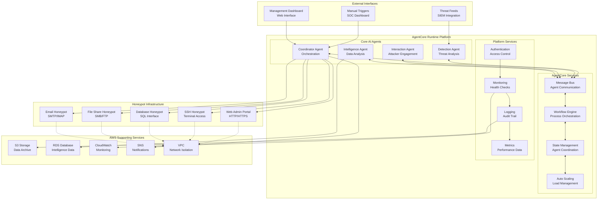
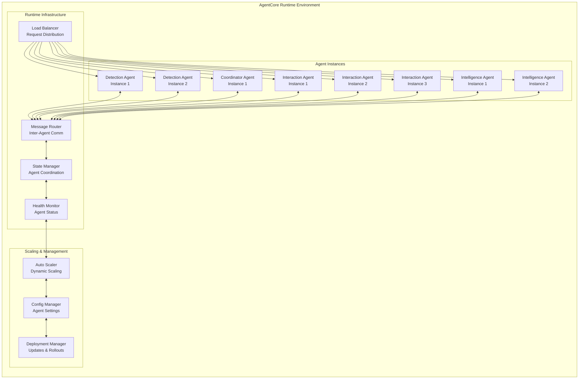

# AI-Powered Honeypot System - Design Document

## Overview

The AI-Powered Honeypot System is built on Amazon AgentCore Runtime, leveraging intelligent AI agents to create dynamic, adaptive honeypots. The system uses multiple specialized agents that work together to detect threats, create realistic deception environments, engage with attackers, and extract actionable intelligence. All agents run as managed services on AgentCore Runtime, providing scalability, reliability, and seamless integration.

## Architecture

### High-Level System Architecture



### AgentCore Runtime Agent Architecture



## Components

### Core AI Agents

#### 1. Detection Agent
**Purpose:** Analyzes incoming threat data and makes engagement decisions
**Responsibilities:**
- Process threat feeds and security alerts
- Evaluate threat confidence using AI models
- Make engagement decisions based on threat analysis
- Coordinate with Coordinator Agent for honeypot deployment

**AgentCore Integration:**
- Deployed as scalable service (2+ instances)
- Receives messages from external threat feeds
- Publishes engagement decisions to message bus
- Maintains threat analysis state

#### 2. Coordinator Agent
**Purpose:** Orchestrates the entire honeypot lifecycle and agent coordination
**Responsibilities:**
- Manage honeypot creation and destruction
- Coordinate between all other agents
- Handle emergency shutdown procedures
- Manage system resources and scaling

**AgentCore Integration:**
- Deployed as singleton service (1 instance)
- Central hub for all agent communication
- Manages workflow orchestration
- Maintains system state and configuration

#### 3. Interaction Agent
**Purpose:** Handles real-time attacker interactions within honeypots
**Responsibilities:**
- Respond to attacker commands and queries
- Maintain realistic system administrator personas
- Generate synthetic data and responses
- Detect and prevent real data exposure

**AgentCore Integration:**
- Deployed as highly scalable service (3+ instances)
- Handles high-frequency interaction messages
- Maintains session state for each attacker
- Scales automatically based on engagement load

#### 4. Intelligence Agent
**Purpose:** Extracts and analyzes intelligence from completed engagements
**Responsibilities:**
- Analyze attacker session transcripts
- Map techniques to MITRE ATT&CK framework
- Generate intelligence reports and IOCs
- Identify patterns and trends across engagements

**AgentCore Integration:**
- Deployed as scalable service (2+ instances)
- Processes completed session data
- Publishes intelligence reports
- Maintains long-term analysis state

### Honeypot Types

#### 1. Web Admin Portal Honeypot
- **Technology:** Flask/FastAPI web application
- **Deception:** Corporate admin dashboard with fake user management
- **Interactions:** Login attempts, user enumeration, privilege escalation
- **Intelligence:** Web attack techniques, credential stuffing, SQL injection

#### 2. SSH Honeypot
- **Technology:** Custom SSH server implementation
- **Deception:** Linux server with realistic file system and commands
- **Interactions:** Command execution, file system exploration, lateral movement
- **Intelligence:** Command-line techniques, tool usage, persistence methods

#### 3. Database Honeypot
- **Technology:** MySQL/PostgreSQL proxy with synthetic data
- **Deception:** Customer database with fake records
- **Interactions:** SQL queries, data extraction, privilege escalation
- **Intelligence:** Database attack techniques, data exfiltration methods

#### 4. File Share Honeypot
- **Technology:** SMB/FTP server with synthetic documents
- **Deception:** Corporate file share with fake sensitive documents
- **Interactions:** File browsing, document access, data theft
- **Intelligence:** File-based attacks, data discovery techniques

#### 5. Email Honeypot
- **Technology:** SMTP/IMAP server with synthetic email accounts
- **Deception:** Corporate email system with fake communications
- **Interactions:** Email access, phishing attempts, account compromise
- **Intelligence:** Email-based attacks, social engineering techniques

## Data Models

### Core Data Structures

#### Threat Event Model
```python
{
    "event_id": "uuid",
    "timestamp": "iso_datetime",
    "source": "string",
    "threat_type": "string",
    "confidence_score": "float (0.0-1.0)",
    "indicators": ["list of IOCs"],
    "engagement_decision": "boolean",
    "decision_rationale": "string"
}
```

#### Honeypot Session Model
```python
{
    "session_id": "uuid",
    "honeypot_type": "enum",
    "start_time": "iso_datetime",
    "end_time": "iso_datetime",
    "attacker_ip": "string",
    "interactions": ["list of interaction objects"],
    "synthetic_data_used": ["list of synthetic data IDs"],
    "intelligence_extracted": "boolean",
    "session_transcript": "string"
}
```

#### Intelligence Report Model
```python
{
    "report_id": "uuid",
    "session_id": "uuid",
    "generation_time": "iso_datetime",
    "mitre_techniques": ["list of technique IDs"],
    "iocs": ["list of indicators"],
    "confidence_score": "float (0.0-1.0)",
    "threat_assessment": "string",
    "recommendations": ["list of strings"]
}
```

#### Synthetic Data Model
```python
{
    "data_id": "uuid",
    "data_type": "enum",
    "synthetic_flag": "true",
    "fingerprint": "string",
    "creation_time": "iso_datetime",
    "usage_count": "integer",
    "content": "encrypted_blob"
}
```

## Data Flow

### 1. Threat Detection Flow
```
External Threat Feed → Detection Agent → Threat Analysis → Engagement Decision → Coordinator Agent
```

### 2. Honeypot Creation Flow
```
Coordinator Agent → Honeypot Infrastructure → Configuration → Activation → Monitoring
```

### 3. Attacker Interaction Flow
```
Attacker → Honeypot → Interaction Agent → AI Response → Synthetic Data → Session Logging
```

### 4. Intelligence Extraction Flow
```
Completed Session → Intelligence Agent → Analysis → MITRE Mapping → Report Generation → Storage
```

## Security Architecture

### Network Isolation
- All honeypots deployed in isolated VPC subnets
- No direct access to production networks
- Egress filtering to prevent external communication
- Network monitoring and anomaly detection

### Data Protection
- All synthetic data clearly tagged and tracked
- Real data detection and automatic quarantine
- Encrypted storage for all session data
- Digital signatures for audit trail integrity

### Access Control
- Multi-factor authentication for management interfaces
- Role-based access control for different user types
- API authentication for external integrations
- Audit logging for all administrative actions

## Error Handling

### Agent Error Handling
- **Agent Failure Recovery:** AgentCore Runtime automatically restarts failed agents with exponential backoff
- **Message Processing Errors:** Failed messages are retried up to 3 times before being sent to dead letter queue
- **State Corruption:** Agents maintain checkpoints and can recover from last known good state
- **Communication Failures:** Circuit breaker pattern prevents cascade failures between agents

### Honeypot Error Handling
- **Honeypot Crashes:** Automatic recreation of failed honeypots within 30 seconds
- **Real Data Detection:** Immediate quarantine and human escalation for any real data exposure
- **Network Isolation Breach:** Emergency shutdown of affected honeypots and security alert
- **Resource Exhaustion:** Graceful degradation and load shedding to maintain core functionality

### System Error Handling
- **Database Failures:** Automatic failover to backup database instances
- **Storage Failures:** Data replication and automatic recovery from backup storage
- **Network Partitions:** Agents continue operating with cached state until connectivity is restored
- **Security Incidents:** Automated incident response with immediate containment and notification

## Testing Strategy

### Unit Testing
- **Agent Logic Testing:** Comprehensive unit tests for each agent's core functionality
- **Data Model Validation:** Tests for all data structures and validation rules
- **Synthetic Data Generation:** Verification that generated data is properly tagged and tracked
- **Security Controls:** Testing of isolation, access control, and data protection mechanisms

### Integration Testing
- **Agent Communication:** End-to-end testing of AgentCore messaging between all agents
- **Honeypot Integration:** Testing of honeypot creation, configuration, and destruction workflows
- **External Service Integration:** Testing of AWS service integrations and third-party APIs
- **Performance Testing:** Load testing to validate scalability and performance requirements

### Security Testing
- **Penetration Testing:** Regular security assessments of honeypot isolation and system security
- **Data Leakage Testing:** Verification that no real data can be exposed through the system
- **Access Control Testing:** Validation of authentication, authorization, and audit controls
- **Incident Response Testing:** Simulation of security incidents and emergency procedures

### End-to-End Testing
- **Complete Engagement Simulation:** Full workflow testing from threat detection to intelligence reporting
- **Multi-Agent Coordination:** Testing of complex scenarios involving all agents working together
- **Failure Scenario Testing:** Testing of system behavior under various failure conditions
- **Performance Under Load:** Testing system behavior with multiple concurrent engagements

## Deployment Strategy

### Local Development Environment
- Docker Compose setup for local testing
- Mock AgentCore Runtime environment
- Synthetic threat feed generators
- Local honeypot instances for development

### AgentCore Runtime Deployment
- Agent deployment using AgentCore CLI
- Automated CI/CD pipeline for agent updates
- Blue-green deployment for zero-downtime updates
- Automated testing and validation

### AWS Infrastructure
- Infrastructure as Code using CDK/CloudFormation
- Automated provisioning of supporting services
- Multi-AZ deployment for high availability
- Disaster recovery and backup procedures

## Monitoring and Observability

### Agent Monitoring
- AgentCore native health checks and metrics
- Custom performance indicators for each agent
- Automated alerting for agent failures
- Distributed tracing for message flows

### System Monitoring
- CloudWatch integration for AWS services
- Custom dashboards for honeypot activities
- Real-time alerting for security incidents
- Performance monitoring and optimization

### Intelligence Reporting
- Automated daily/weekly intelligence summaries
- Trend analysis and pattern recognition
- Integration with external threat intelligence platforms
- Custom reporting for different stakeholder needs

## Scalability Considerations

### Agent Scaling
- Horizontal scaling based on message queue depth
- CPU and memory-based scaling triggers
- Predictive scaling for known traffic patterns
- Cost optimization through right-sizing

### Data Scaling
- Automated data archiving and lifecycle management
- Partitioned storage for high-volume data
- Caching strategies for frequently accessed data
- Data retention policies and compliance

### Infrastructure Scaling
- Auto-scaling groups for honeypot infrastructure
- Load balancing for high-availability services
- Geographic distribution for global coverage
- Capacity planning and resource optimization